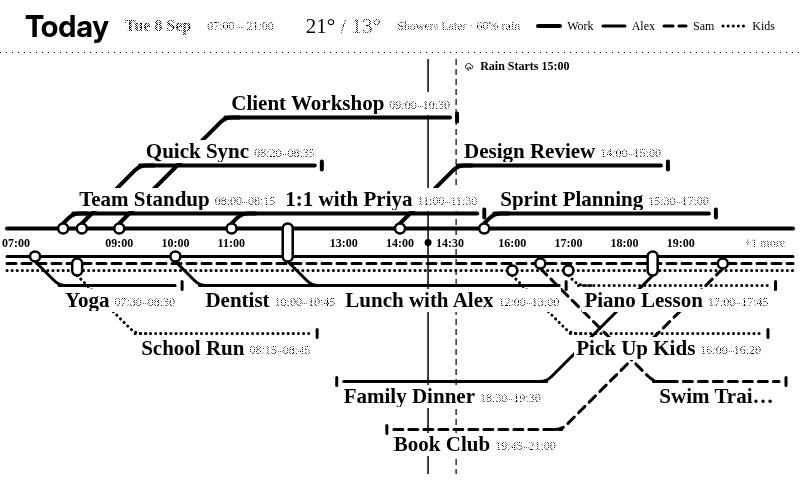

# Metro Timeline — Design

A single day drawn as a transit diagram: one line per person, running the full
length of the canvas in one bundle, with the hour axis down the middle of the
bundle. Events are stations on their owner's line; their labels sit on
branches that leave the line at 45°. Everything below is computed client-side
in `src/shared.liquid` from the raw facts `src/transform.js` returns
(events with start/end minutes, owner, side, hue and dash pattern; weather
milestones; `now_min`). Reference renders live in `docs/`.

## Orientation

`orientation` setting: `auto` (default), `horizontal`, `vertical`. Auto runs
the timeline left-to-right when the canvas is landscape (width > 1.1 × height)
and top-to-bottom otherwise. All geometry is written in axis coordinates
(`a` along time, `c` across) and mapped to x/y at draw time, so both
orientations share one algorithm.

Work (the calendar named "Work", or the first configured person) is side A:
above the bundle in horizontal mode, left of it in vertical mode. Everyone
else is side B.

## Spine

- Hour labels run in a gutter in the middle of the bundle; side A's lines sit
  on one side of the gutter, side B's on the other. No branch ever has to
  cross the hour labels, only sibling lines (a normal metro flyover).
- Lines: 7px apart, 3px wide (4px for Work), solid / dashed / dotted / dash-dot
  in track order per side. On a 1-bit panel every line is black and the dash
  pattern is the only identifier; on 2/4-bit panels each person's `hue-40`
  token is resolved through `TRMNLPaint.stroke`, so themes and dark mode apply.
- The bundle is not centred by default: after lane placement, whichever side
  needs more lanes gets more room, and any leftover space spreads the lanes
  out (up to 1.5×) so a quiet day still fills the canvas.
- The "now" marker is a thin line across the whole canvas with a dot and the
  time in the gutter. Weather milestones are dashed lines across the canvas;
  the label sits in a reserved band at the top (horizontal) or beside the
  bundle on the quieter side (vertical), where it counts as an obstacle for
  lane placement.

## Line names and sky markers

- Horizontal mode: each line begins at its own named terminus and fans into
  the bundle at 45°, one label height apart, at whichever end of the axis
  has a quiet stretch (start first, then end). The fan region is an obstacle
  for lanes. If neither end is free, or in vertical mode, each line gets a
  small lettered bullet instead (at the start of the axis horizontally, the
  end vertically). The header legend is always drawn as well (hidden only on
  tiny canvases when the lines are named on the map).
- Sunrise, sunset and rain start/stop are sky markers: an icon with the time
  or text, in a band along the top edge (horizontal) or beside the bundle on
  the quieter side (vertical, where they block lanes), plus a guide line
  across the map (dotted for sun, dashed for rain).

## Stations and branches

- A ring on the owner's line at the true start time. Rings never move.
- An interchange (an event with `co_owners`) is a capsule spanning every
  involved line; the branch leaves from the capsule's outer edge on the
  primary owner's side.
- A branch is a 45° diagonal to a lane, then a run along the lane carrying the
  label. If the event is long enough (end time beyond the label plus another
  45° leg) the branch comes back and rejoins the owner's line at the end
  time; otherwise it ends in a short terminus bar. Bends are rounded.
- Label text sits on the outside of the run (above it for side A, below for
  side B in horizontal mode; beside it in vertical mode), left-aligned at the
  elbow, with the time tag inline after the title and the location on a
  second line.

## Lane placement

Lanes are parallel rows (horizontal) or columns (vertical) outside the
bundle, `label thickness + gaps` apart. Events are placed in chronological
order, each trying lanes from the innermost out, forward first:

1. A lane holds line and text intervals along the axis, tagged by owner.
   Another owner's line or text under the candidate's span blocks the lane.
   The candidate's own owner's earlier text pushes the label further along
   the lane, and the candidate's ring then feeds into that same spur: back-
   to-back meetings become one branch with several stations on it, and the
   diagonal keeps its 45°.
2. If only another owner's item is in the way, as a last resort the whole
   elbow slides past it (the diagonal steepens); this is penalised in the
   score.
3. A diagonal that would pass through text in an inner lane is avoided; if it
   can't be, it is allowed with a penalty (labels are white-backed, so the
   line disappears behind the text rather than through it). Placing a label
   over the spots where later events' diagonals will climb is penalised too,
   which nudges early long labels outward.
4. A label that would overrun the end of the axis first loses its time tag,
   then its title is ellipsised (down to half its width, at least 70px);
   only when neither fits may the branch go backward (label before the ring).
5. Candidates are scored: label slide + elbow slide + lane depth + backward +
   crossing + truncation; the lowest score wins. Nothing fitting means the
   event is dropped and counted in "+N more" at the end of the axis.

Lane budget: pass 1 places everything with unlimited lanes to learn what each
side needs. If both sides fit, the spine is positioned and lanes spread. If
not, each side that has events gets one lane and further lanes are handed to
whichever side still wants more, only while they fit.

## Fitting small screens

- Text ladder: the canvas size picks a starting tier (`title--xlarge` on a
  TRMNL X, down to `label--small` on a quadrant; time tag and location on or
  off). The layout is retried one step down the ladder (drop location →
  smaller title → drop time) while that improves a quality score (dropped
  events, diagonals through text, slid elbows, backward branches); the
  largest tier with the best score wins, and leftover cross space spreads the
  lanes up to 2.2×.
- Time window: the axis first fits itself to where the day's actual content
  is — the earliest event start to the latest event end, padded 75 minutes
  on each side and including "now" — rather than always spanning the fixed
  07:00–21:00 day, so a quiet day's events fill the canvas instead of being
  crammed into one corner of an otherwise-empty one. It never fits tighter
  than a 6-hour span. If that content-fit range still can't give every hour
  ~46px (horizontal) / ~38px (vertical), scaled ×1.8 when there is little
  cross room, it's squeezed further around now (starting an hour before it)
  and events outside it are summarised as "+N earlier" / "+N more" in the
  gutter. Hour labels thin out (every 2, 3, 4, 6 hours) to fit.
- Header: compact (no window, no conditions) under 640px wide or 300px tall;
  tiny (no date, no temperature, small title) under 430×200.
- Alert labels are skipped below 200px of cross room (the dashed line stays).

## Device scaling

TRMNL X renders the page zoomed (~1.8–2×). All positions are in layout px
(`offsetWidth`/`offsetHeight`); measurements from `getBoundingClientRect()`
are divided by the zoom factor. Geometry constants are multiplied by
`TRMNLPaint.px(1, {kind: 'ui'})`.

## Debugging

The canvas carries a `data-metro-debug` attribute with the chosen
orientation, window, spine position, per-side lane counts, resolved colours
and each event's placement (lane, direction, elbow, text start, or DROP).
Build with `trmnlp build`, inject the device's `screen--*` classes into the
`.screen` element, and read the attribute with headless Chrome `--dump-dom`.
