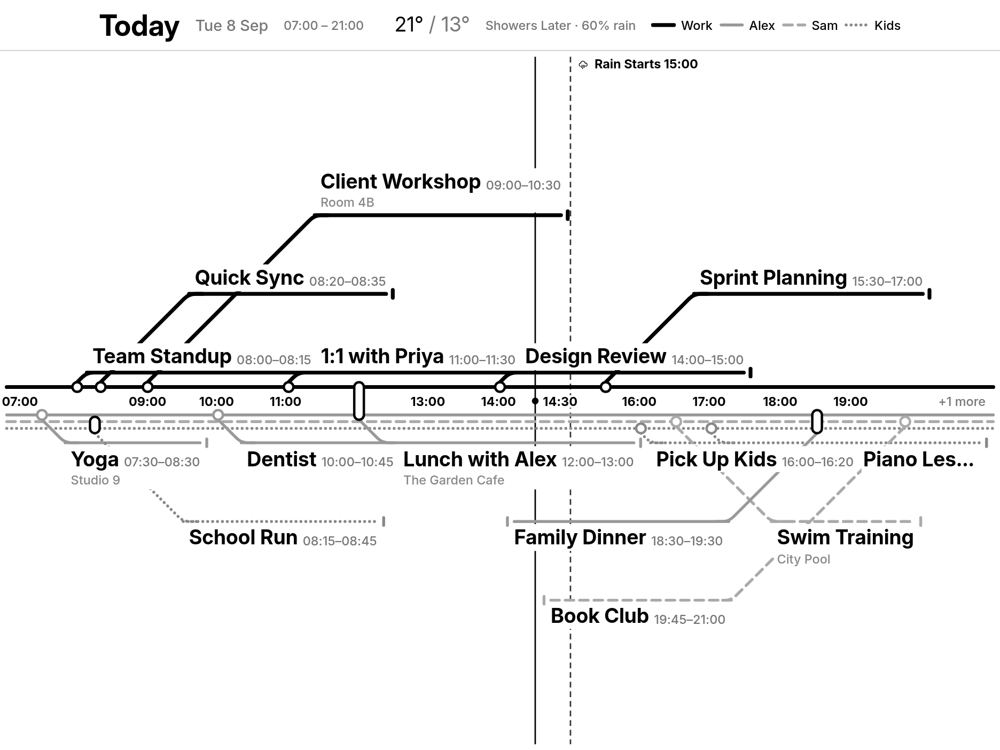

# Metro Calendar for TRMNL

Your family's day drawn as a transit map. One line per line runs along a
central spine with the hour axis down its middle; events are stations,
labels sit on 45° branches, long events loop out and rejoin their line, and
the whole thing lays itself out to the screen it lands on: TRMNL OG, OG V2,
TRMNL X in landscape or portrait, and every mashup size.



It runs entirely on TRMNL **Serverless**: `plugin/src/transform.js` fetches
your ICS feeds and normalises them, `plugin/src/shared.liquid` draws the map.
No server of your own.

## What it shows

- Today, 07:00–21:00 (narrowed around now on small views), with "+N earlier"
  and "+N more" counts at the ends of the line.
- Each line gets a side of the spine, a dash pattern and (on grayscale and
  colour panels) a shade, all picked for you: sides are balanced against the
  day's actual event counts, busiest line first. A line is named where it
  enters the map, and appears in the legend.
- Events as rings at their true start time; shared events as capsules across
  the lines involved. Title, time and location on the branch.
- The current time, sunrise and sunset, and rain start/stop markers across
  the map; today's high/low and conditions in the header.
- English, French, Spanish, German and Dutch, following your TRMNL account
  language; 12- or 24-hour clocks.

## Setup

1. In TRMNL: **Plugins → Private Plugins → New**, name it, save. Then from
   this repo's `plugin/` folder run `trmnlp push` (it uploads settings,
   templates and `transform.js`).
2. The plugin starts on a demo board. **Demo Board** picks which one; see
   [the demo folder](demo/) for what each shows.
3. To show your own calendars, turn **Use Demo Data** off and paste your ICS
   links into **Calendars**, one per line. That is the whole setup: each
   calendar becomes its own line on the map, named after the calendar.
4. Only if you want more, such as routing events to people, sharing an
   event between them, or renaming and hiding things, paste a JSON config
   into that same box instead. It is read as JSON automatically. Build it
   with the
   [Configuration editor](https://excusemi.github.io/trmnl-metro-calendar-plugin/tools/config-editor.html),
   which also previews the map at every device size, or write it by hand
   (see [CONFIG.md](CONFIG.md)). No ICS links yet? The editor's **Start**
   section has three presets (*Family of 4*, *Work vs Personal Split*,
   *Solo Freelancer Line*): pick one, draw the map, then swap the
   placeholder links for your own. Each demo board is also a worked example:
   [demo/simpsons/config.json](demo/simpsons/config.json),
   [demo/futurama/config.json](demo/futurama/config.json),
   [demo/friends/config.json](demo/friends/config.json).
5. Optional settings: **Time Format**, and **Location** for weather and sun
   times.

### Getting an ICS link

- Google Calendar: calendar settings → *Secret address in iCal format*.
- Apple iCloud: share the calendar as public, copy the `webcal://` link.
- Outlook: calendar settings → *Shared calendars* → publish → ICS link.

## Configuration in one glance

```json
{
  "lines": [
    { "name": "Sam" },
    { "name": "Alex" },
    { "name": "Kids" }
  ],
  "calendars": [
    { "name": "Work", "url": "https://…/work.ics", "rules": [{ "match": { "type": "any" }, "line": "Sam" }] },
    { "name": "Alex", "url": "https://…/alex.ics", "rules": [{ "match": { "type": "any" }, "line": "Alex" }] },
    { "name": "School", "url": "https://…/school.ics",
      "rules": [{ "match": { "type": "word", "value": "L2" }, "line": "Kids" }, { "match": { "type": "contains", "value": "staff" }, "hide": true }] }
  ]
}
```

A line is just a name: which side of the map it runs on, what colour it is
and which dash pattern it gets are all worked out from the day itself, so
there is nothing to choose. (`side` and `color` on a line are still read,
so an older configuration that sets them keeps working.)

A calendar's `name` is worth a second's thought: any event in it that no rule
routes falls back to that name, and the fallback name is drawn as a *line*.
Name a calendar after the person whose line it is, or leave it unnamed when
its rules route everything, or you get an extra line named after the
calendar.

Rules match on the title (`word`, `contains`, `exact`, `regex`, `status`,
`weekday`, `any`, or `and`/`or` of those) and can assign one or more lines,
rewrite the title, or hide the event. Everything is documented in
[CONFIG.md](CONFIG.md); the design of the map itself in [DESIGN.md](DESIGN.md).

Limits worth knowing: recurring events are expanded for `FREQ=WEEKLY` rules
(with `BYDAY`/`UNTIL`) plus any single occurrence dated today; all-day events
are not drawn.

## Development

```bash
cd plugin && trmnlp serve      # local preview at http://127.0.0.1:4567
./test.sh                      # transform + editor test suites (Node only)
```

The layout is verified with headless-Chrome screenshots of `trmnlp build`
output at real device sizes; the renders in `docs/` come from that. The
editor needs to be served over http to load the plugin template for its
preview (`python3 -m http.server` from the repo root works).

## License

MIT, see [LICENSE](LICENSE).
