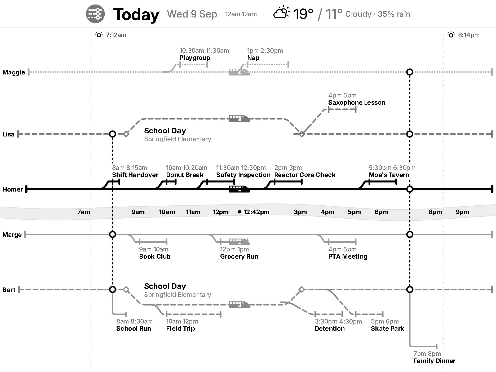

# Open

- Merge tracks: when having a joined event, have all the tracks
  participating next to each other 

- Merge duplicate events across tracks: School Day should be the same event
  for both Bart and Lisa . Maybe evenly split
  between on top or below or depending on what would fit best.

- Improve the fonts: https://trmnl.com/framework/docs/3.3/font_family.
  Partly blocked: the device's Font Family setting (Default / Classic /
  TRMNL) only redefines `--title-*` and `--label-*` for the roles it names,
  and `title--xlarge` / `title--large` (the two biggest tiers, the ones a
  TRMNL X actually uses) are not among them, so those tiers stay on Inter
  whatever the device is set to. Verified locally with the framework
  webfonts downloaded and the CSS font paths rewritten. Needs a decision:
  cap the tier ladder at `title--base` so the setting always applies, or
  leave the big tiers alone.

# Done

- ~~buildLabel should use the framework position utilities instead of
  styles.~~ Text alignment is `text--left` / `text--right` now. The
  remaining inline styles are arbitrary pixel offsets and measured
  max-widths, which have no utility class.

- ~~Detention event not starting from the actual track~~
   and ~~Saxophone Lesson branch starting
  too early~~ . Both were the same thing: the branch
  left the trunk a 45° diagonal's worth of lead BEFORE the event, and how
  much lead depended on how deep the lane was, so a deep lane meant leaving
  an hour early. The lead is now capped at two corner radii: a shallow drop
  still gets its 45° ramp, and anything deeper goes fully vertical at its
  own minute rather than steepening.

- ~~Not proper curve on smaller events when the branch goes horizontal~~
   — same fix: a right angle with a rounded corner
  instead of a squeezed diagonal.

- ~~Straighten the river or have the times centered properly in the river.~~
  The two banks carried the same wave, so the whole river translated while
  the hour labels stayed on the spine. The banks now mirror each other: the
  river breathes wider and narrower around a centreline that never moves.

- ~~Auto-assign track colours/patterns so themes work.~~ Both configs and
  DEMO_CONFIG dropped their pinned greys, so the framework hue cycle picks
  the palette and a theme can repaint it. Dash patterns are now handed out
  globally in board order rather than per side: two lines on opposite sides
  were both getting "dashed", and since every hue collapses to the same grey
  on a greyscale panel, that left two lines a reader could not tell apart.
  Every hardcoded hex in the drawing is gone too, so hollow markers are the
  canvas colour and drawn ones are the text colour in either theme.

- ~~Branch connectors overshooting, corner not smooth.~~ Two things: the
  start tick was collinear with a vertical drop and read as the line
  overshooting its own rail, and roundedPath was clamping the branch's
  corner to half the radius the fork's got. A branch now takes the 45° ramp
  whenever the drop is shallow enough to afford it (which is most events)
  and goes fully vertical only for a deep dive.

- ~~Time labels not visible in dark mode (white text on light gray river).~~
  The river is now a 9% wash of the text colour rather than a named grey, so
  it is a shade off the paper in either theme.
