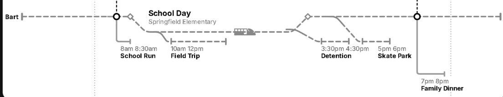
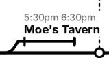

# Open

- Improve the fonts: https://trmnl.com/framework/docs/3.3/font_family.
  Partly blocked: the device's Font Family setting (Default / Classic /
  TRMNL) only redefines `--title-*` and `--label-*` for the roles it names,
  and `title--xlarge` / `title--large` (the two biggest tiers, the ones a
  TRMNL X actually uses) are not among them, so those tiers stay on Inter
  whatever the device is set to. Verified locally with the framework
  webfonts downloaded and the CSS font paths rewritten. Needs a decision:
  cap the tier ladder at `title--base` so the setting always applies, or
  leave the big tiers alone.

# Done

- ~~Merge tracks: a joined event's participants next to each other.~~ The
  lines are laid out as one chain, strongest shared-event link first, and
  the board is cut once to split it into two sides. Consecutive pairs stay
  adjacent, including the pair either side of the spine.

- ~~Merge duplicate events across tracks.~~ Anything with the same title
  over the same minutes is one event on several lines. A shared station
  still kinks every line it is on — both children really are at school —
  but it is captioned once, midway between them.

- ~~Show more of the day if needed.~~ The day stretches to fit what is on
  it, an hour before the first thing and 90 minutes after the last. That
  tail is what a late event's label runs into.

- ~~Remove the Timeline Orientation setting.~~ Gone from the plugin
  settings, the transform and the config editor. The timeline runs along
  whichever side of the canvas is longer, which is the only answer that is
  ever right.

- ~~Track name can clip into the river.~~ Where the name would land in the
  water it goes under its own line instead.

- ~~Event name can cover the train car.~~ The one label the car is under
  steps back by the car's height, and only where the car actually overlaps
  it along the axis.

- ~~Let the event title have 2 lines at least.~~ Titles and station captions
  wrap to two lines before they are cut.

- ~~Increase the label size of the track names, move it above the actual
  track start.~~ One size up, and sitting on the line's starting bar instead
  of in a column beside it — which gave the day back the width the column
  was eating. Standing up they keep the column, because there the names run
  along their lines and the lines are a track-step apart.

- ~~A rounded dot instead of the first tick.~~ Functionally fine: a filled
  dot is standard notation for a stop a line calls at, and it stays clear of
  the hollow ring (interchange) and hollow diamond (station junction). It
  also solves the thing a tick could not — the start of a rail is usually a
  bend, and a dot sits ON the line rather than across it.

- ~~Metro car on top of the track; branch further for smaller events.~~ The
  car is anchored at its wheels now, and the shallowest branch sits a car's
  height off the trunk so a train on a short spur has room.

- ~~Ramps should be in the style of the track they are on; we need one ramp
  builder that handles all of these, with extensive tests.~~ Every departure
  and rejoin is now one function. The elbow used to be forced solid because
  its lead-in lies ON the trunk and a dashed overlay starting its pattern
  from zero doubled the line visibly. The fix was phase, not paint: the ramp
  asks the trunk how far along itself the lead-in starts and offsets its
  dashes by that much, so the overlay disappears and the ramp can wear the
  real stroke. A spur wears the line it GROWS FROM, which for an interchange
  is the outermost rail it joins. `test/layout/cases/ramps.js`, 14 cases.

- ~~buildLabel should use the framework position utilities instead of
  styles.~~ Text alignment is `text--left` / `text--right` now. The
  remaining inline styles are arbitrary pixel offsets and measured
  max-widths, which have no utility class.

- ~~Detention event not starting from the actual track~~
   and ~~Saxophone Lesson branch starting
  too early~~ . Both were the same thing: the branch
  left the trunk a 45° diagonal's worth of lead BEFORE the event, and how
  much lead depended on how deep the lane was, so a deep lane meant leaving
  an hour early. The lead is now capped at two corner radii: a shallow drop
  still gets its 45° ramp, and anything deeper goes fully vertical at its
  own minute rather than steepening.

- ~~Not proper curve on smaller events when the branch goes horizontal~~
   — same fix: a right angle with a rounded corner
  instead of a squeezed diagonal.

- ~~Straighten the river or have the times centered properly in the river.~~
  The two banks carried the same wave, so the whole river translated while
  the hour labels stayed on the spine. The banks now mirror each other: the
  river breathes wider and narrower around a centreline that never moves.

- ~~Auto-assign track colours/patterns so themes work.~~ Both configs and
  DEMO_CONFIG dropped their pinned greys, so the framework hue cycle picks
  the palette and a theme can repaint it. Dash patterns are now handed out
  globally in board order rather than per side: two lines on opposite sides
  were both getting "dashed", and since every hue collapses to the same grey
  on a greyscale panel, that left two lines a reader could not tell apart.
  Every hardcoded hex in the drawing is gone too, so hollow markers are the
  canvas colour and drawn ones are the text colour in either theme.

- ~~Branch connectors overshooting, corner not smooth.~~ Two things: the
  start tick was collinear with a vertical drop and read as the line
  overshooting its own rail, and roundedPath was clamping the branch's
  corner to half the radius the fork's got. A branch now takes the 45° ramp
  whenever the drop is shallow enough to afford it (which is most events)
  and goes fully vertical only for a deep dive.

- ~~Time labels not visible in dark mode (white text on light gray river).~~
  The river is now a 9% wash of the text colour rather than a named grey, so
  it is a shade off the paper in either theme.
